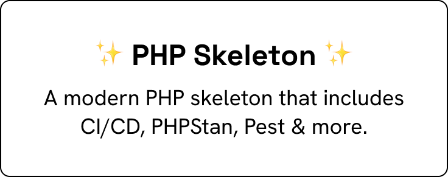

<p align="center">
    
    <p align="center">
        <a href="https://github.com/benjaminhaeberli/php-skeleton/actions"></a>
        <a href="https://packagist.org/packages/benjaminhaeberli/php-skeleton"></a>
        <a href="https://packagist.org/packages/benjaminhaeberli/php-skeleton"></a>
        <a href="https://packagist.org/packages/benjaminhaeberli/php-skeleton"></a>
    </p>
</p>

---

## Getting started 🔎

### Requirements

-   **PHP [8.3+](https://php.net/releases/)**

### Installation

Create your package using [Composer](https://getcomposer.org)

```bash
composer create-project benjaminhaeberli/php-skeleton --prefer-source PackageName
```

Install [Composer](https://getcomposer.org) packages

```bash
composer install
```

## Commands ⌨️

> More details in [composer.json](./composer.json)

### Common

🧹 Keep a modern codebase with [**Pint**](https://laravel.com/docs/11.x/pint) ([see default config](https://github.com/laravel/pint/blob/main/resources/presets/laravel.php))

```bash
composer pint
```

⚗️ Run static analysis using [**PHPStan**](https://phpstan.org/user-guide/command-line-usage)

```bash
composer phpstan
```

✅ Run unit tests using [**PEST**](https://pestphp.com/docs/writing-tests)

```bash
composer pest
```

🚀 Run the entire test suite

```bash
composer test
```

🧰 Validate `composer.json` and update dependencies

```bash
composer make:composer
```

📈 Expose [code coverage](https://pestphp.com/docs/test-coverage) using [**PEST**](https://pestphp.com/docs/test-coverage) (_require XDEBUG in `coverage` mode_)

```bash
composer pest:coverage
```

### Code quality & refactoring

💎 Measure the code quality with [**PHPInsights**](https://phpinsights.com/) _(see config\insights.php)_

```bash
composer phpinsights
```

✅ Run refactors using [**Rector**](https://getrector.com/documentation)

```bash
composer rector
```

**PHP skeleton** is maintained by **[Benjamin Haeberli](https://twitter.com/1benjam1)** under the **[MIT license](https://opensource.org/licenses/MIT)**.
